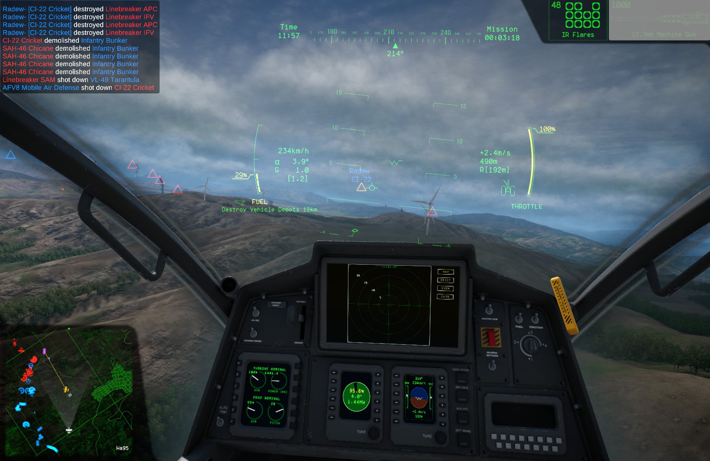
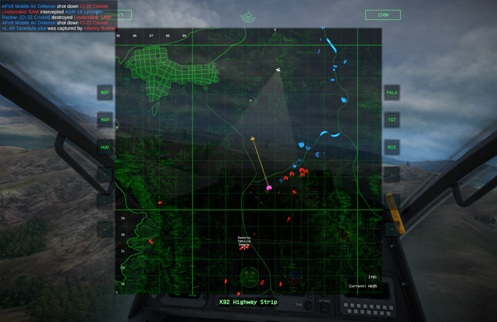

# NoWingmen

A [BepInEx](https://github.com/BepInEx/BepInEx) plugin for **Nuclear Option** that adds different visualising
options for your wingmen and friends.

> [!NOTE]
> It only has visual effect thus can be used by any client without affecting anything on the server.

## Features

- **Wing** — mark any player of your faction as a wingman with a hotkey.
- **Friends** — automatically mark your Steam friends flying for the same faction.
- **Target selection** — highlight enemies your wing (or the whole team) has already selected.
- **Lock prevention** — skip enemies already selected by your wing when cycling targets.

Hotkeys are bound in the game's own **Controls** menu, under the **Gameplay** section:

## Screenshots

Marks on the HUD:

Marks and lines on the map:

## Installation

1. Install [BepInEx 5](https://github.com/BepInEx/BepInEx) into your Nuclear Option folder.
2. Install [Extra Input Framework](https://github.com/Assassin1076/NuclearOptionInputFramework/releases) into `BepInEx/plugins`.
4. Put `NoWingmen.dll` into `BepInEx/plugins`.

## License

[Apache-2.0](./LICENSE)
