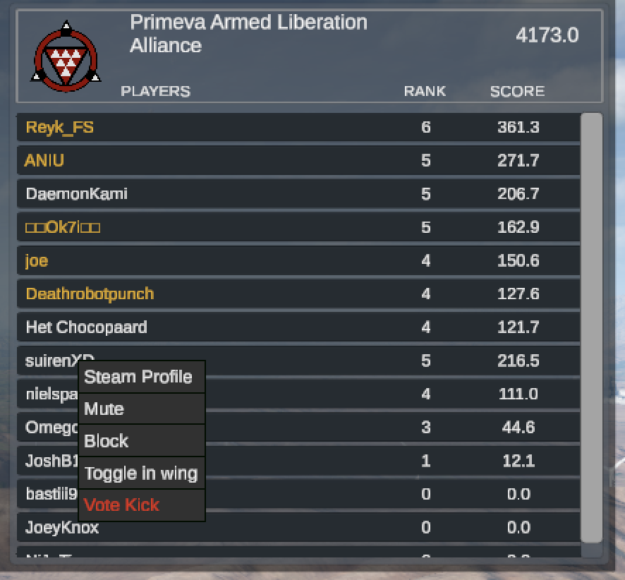
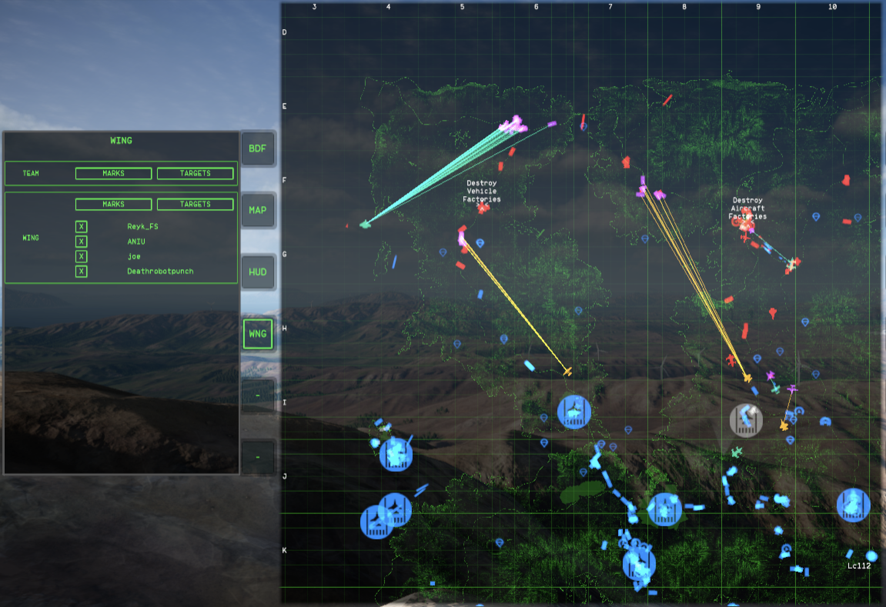

# NoWingmen

A [BepInEx](https://github.com/BepInEx/BepInEx) plugin for **Nuclear Option** that adds different visualising options
for teammates.

> [!NOTE]
> It only has visual effect thus can be used by any client without affecting anything on the server.

## Features

- **Wing** - mark any player of your faction as a wingman: pause, right-click them on the leaderboard, and pick *Toggle
  in wing*.
- **Teammates** - automatically mark every other player aircraft of your faction.
- **Target selection** - mark the enemies your wing and your teammates have already selected, and draw a line on the map
  from each of them to their target.
- **Wing screen** - a *WNG* page on the map's MFD: mod options and your wing roster.
- **Lock prevention** - skip enemies already selected by others when cycling targets. Enabled by default, and toggled in
  flight by a hotkey.

Marks are color-coded:

- Wing: 
- Teammates: 
- Targeted enemies: 

The lock prevention hotkey is bound in the game's own **Controls** menu, under the **Gameplay** section:

## Screenshots

Right-click menu and wing highlighting on the leaderboard:

Marks on the HUD:

Wing screen, marks and target lines on the map:

## Installation

### Nuclear Option Mod Manager

1. Open NOMM.
2. Search for `NoWingmen`.
3. Click toggle to install.

### Manual

1. Install [BepInEx 5](https://github.com/BepInEx/BepInEx) into your Nuclear Option folder.
2. Install [Extra Input Framework](https://github.com/Assassin1076/NuclearOptionInputFramework/releases) into
   `BepInEx/plugins`.
3. Put `NoWingmen.dll` into `BepInEx/plugins`.

## License

[Apache-2.0](./LICENSE)
